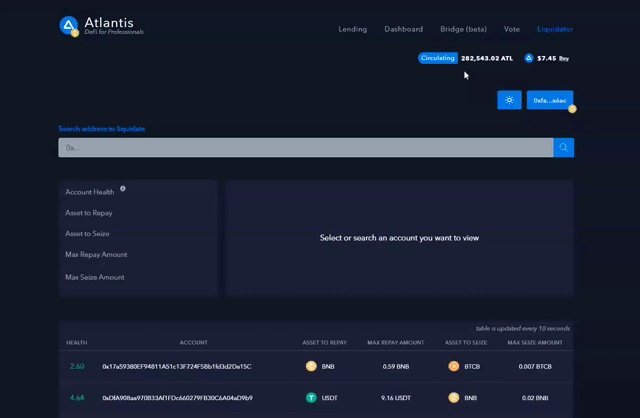

# Governance

The image illustrates three forms of DeFi governance. Atlantis is classified as decentralized governance, decisions move fully to a community of token holders through the establishment of a decentralized autonomous organization (DAO). DAO participants vote on changes to the protocol and are aligned through token incentives and rules written into smart contracts. Governance decisions are executed as blockchain transactions, enforced through the consensus mechanisms of the settlement layer.

## Approving to vote

To participate in the voting process, all users must enable their wallet to vote on the protocol. Which can be done on the [voting page](https://atlantis.loans/vote).

## Voting Balance

A small balance of $ATL is required to be in your wallet to vote. Current voting system takes snapshot of voting weight based on $ATL holdings in wallet and staked balance in the ATL single vault on Binance Smart Chain.

## Delegation Type

Manual voting: This option allows you to vote on proposals directly from your connected wallet. Delegate voting: This option allows you to delegate votes to another address.

## How to vote

on the Proposals table you have the ability to vote **FOR** or **AGAINST** the proposal.

> To view more information about the proposal click on the proposal within the table.

## Create Proposals

The requirement of creating a proposal is a delegation of 65000 ATL tokens.

## Where are ideas made?

The community comes with idea's. If a large proportion of the community want to start a vote poll it will be made on telegram or discord.

If the majority of people vote for YES it will be created as a proposal on the platform.

.png>)
