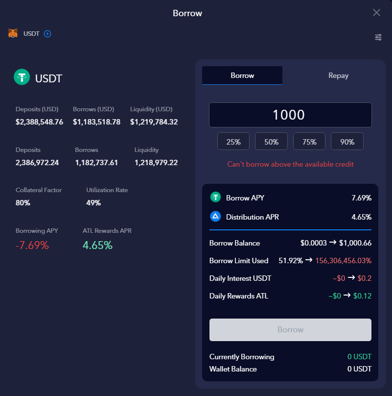

# How to borrow tokens

After you supplied your asset(s) and put them as **collateral** you are now **eligible** to borrow assets.

Borrowing function can be found under the **Lending** tab of the protocol. Clicking on any asset supported under the lending tab grants access to the borrowing function.

On the image below this person is about to borrow 1,000$ in $USDT. The Application gives a indication of the daily interest rate of borrowing $USDT.&#x20;

